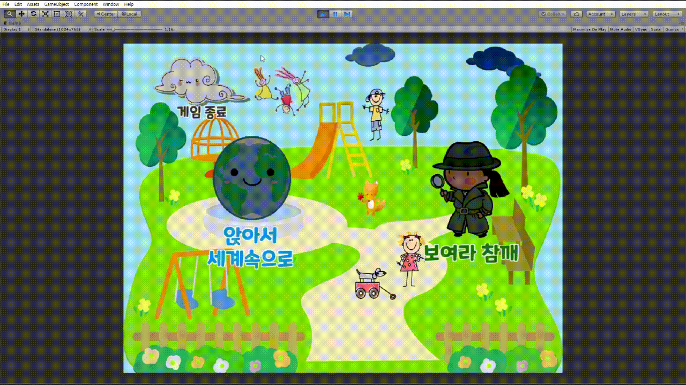
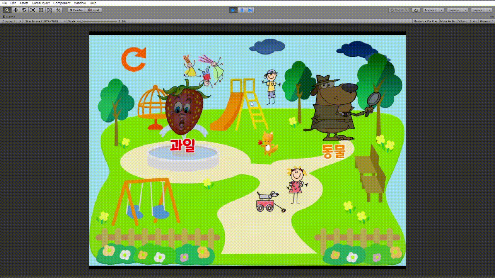

# SENSE-T
어린이집 교육 보조 프로그램 (Unity 프로젝트)

## How?
어린이집의 요구사항을 바탕으로 개발했기 때문에 실행환경도 어린이집에 맞게 개발되었다. 그에 따라 윈도우 응용프로그램으로 개발해야하며 게임 개발에 적합한 Unity를 선택했다. 모든 팀원이 처음 하는 것이기에 초반에는 Unity 기초를 학습하는 스터디 기간을 가진 후 설계, 개발에 착수했다.
- "앉아서 세계속으로"
    - 세계지도를 포함하며 독자적인 기능을 제공하기 위해 직접 지도를 렌더링했다.
    - 각 국가 이미지 파일과 좌표 데이터를 통해서 렌더링하고 지도 이동(드래그) 및 확대/축소(휠) 기능을 구현하였다.
- "보여라 참깨"
    - 동물 그림자를 통해서 어떤 동물인지 유추한다. 그림자 중 일부분을 공개하여 조금씩 힌트를 제공할 수 있다.
    - 과일의 단면을 통해서 어떤 과일인지 유추한다. 직접 과일의 이미지와 단면 이미지를 디자인했다면 더 좋았을 것이다.

## Demo
### 앉아서 세계속으로
아이들이 세계에 대해서 쉽게 이해하고 배울 수 있도록 만든 게임이다. 위 사진은 게임 시작화면에 이어서 "앉아서 세계속으로"를 실행하는 화면이다.
  
지도 위 국가를 클릭하면 해당 국가의 모양, 위치, 국가를 파악할 수 있다. 마찬가지로 좌측 리스트의 항목을 클릭하거나 밑에 검색을 통해서도 볼 수 있다.
  
국기를 클릭하면 해당 국가에 대한 정보창이 나온다. 수도, 언어, 특징, 관광지 사진을 볼 수 있다.
  

### 보여라 참깨
과일 또는 동물의 일부분만 보고 어떤 것인지 유추하는 게임으로 대상을 보다 입체적으로 이해할 수 있다.
동물의 그림자를 보고 어떤 동물인지 유추하는 게임이다. 돋보기 펭귄 버튼을 클릭하면 일부분을 보여주면서 동물에 대한 힌트를 제공한다. 조명 토끼 버튼을 클릭하면 답을 보여준다.
  
과일의 단면을 통해 어떤 과일인지 맞추는 게임이다. 돋보기 버튼으로 어떤 과일의 단면인지 알려준다.

## Team
- 장민호
- 황경배
- 이정윤
- 김민규
- 강찬우
